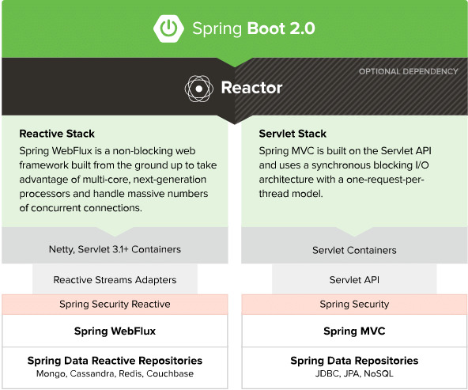
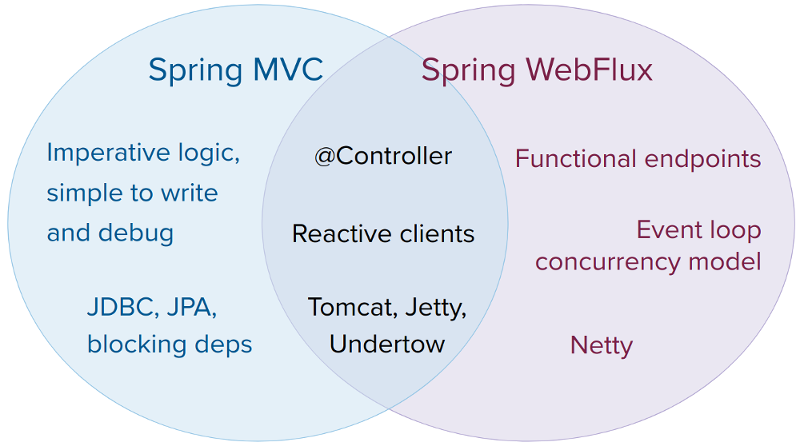
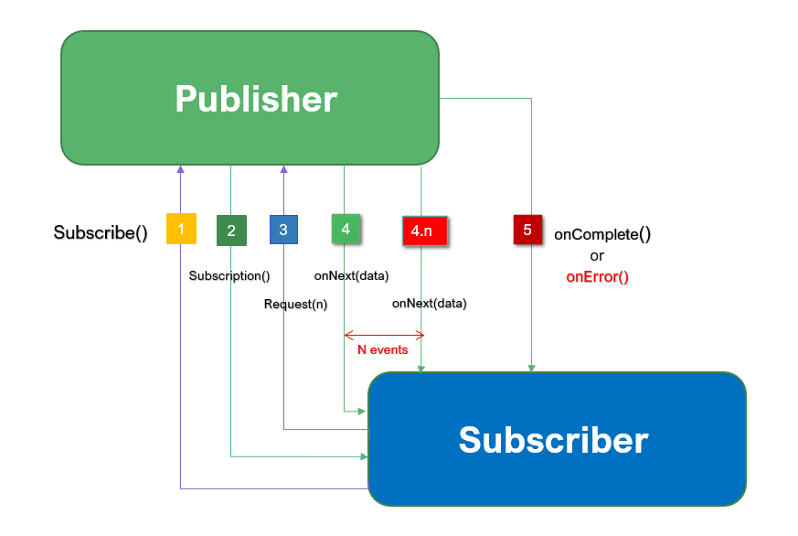

 # Reactive Programming 

* Its new style of Programming paradigm 
    * Asynchronous and non blocking 
    * Functional Style Code 
    * Data Flow as event driven stream 
    * Backpressure on data stream 

## Spring Webflux 
* Spring WebFlux is a reactive programming framework for building web applications in Java. 
 * It is part of the Spring ecosystem and is built on top of the Reactor project, which provides a reactive programming API for building asynchronous and non-blocking application

  <BR/><BR/>
 


## Reactive Programming Specfication 

* Publisher or Producer 
    * Publisher is data source who always publishes an event 
    * Just like server in traditional way 
        ```java
        public interface Publisher<T> {
            public void subscribe(Subscriber<? super T> s);
        }
        ```
* Subscriber or Consumer 
    * Subscriber will subscribe/consume the events from publisher 
    * Just like server in traditional way 
    * For each data transfer, onNext method will be called 
        ```java
        public interface Subscriber<T> {
            public void onSubscribe(Subscription s);
            public void onNext(T t);
            public void onError(Throwable t);
            public void onComplete();
        }
        ```
*  Subscription 
    * Subscription represents the unique relationship between a subscriber and a publisher 
    * The Subscriber is in control over when elements are requested and when more elements are no longer needed.
        ```Java 
        public interface Subscription {
            public void request(long n);
            public void cancel();
        }
        ```
* Processor
    * A Processor represents a processing stage—which is both a Subscriber and a Publisher and MUST obey the contracts of both
    * The intent of this rule is to establish that Processors behave, and are bound by, both the Publisher and Subscriber specifications
        ```Java 
        public interface Processor<T, R> extends Subscriber<T>, Publisher<R> {
            }
        ```
Note : 
The Reactive Streams API prescribes that all processing of elements (onNext) or termination signals (onError, onComplete) MUST NOT block the Publisher. However, each of the on* handlers can process the events synchronously or asynchronously.

## Reactive Stream Workflow 

 


## Reactive Programming Library 
* Reactor 
    * Spring Webflux is implemented using Reactor 
* RxJava 
* JDK9 Flow reactive stream 