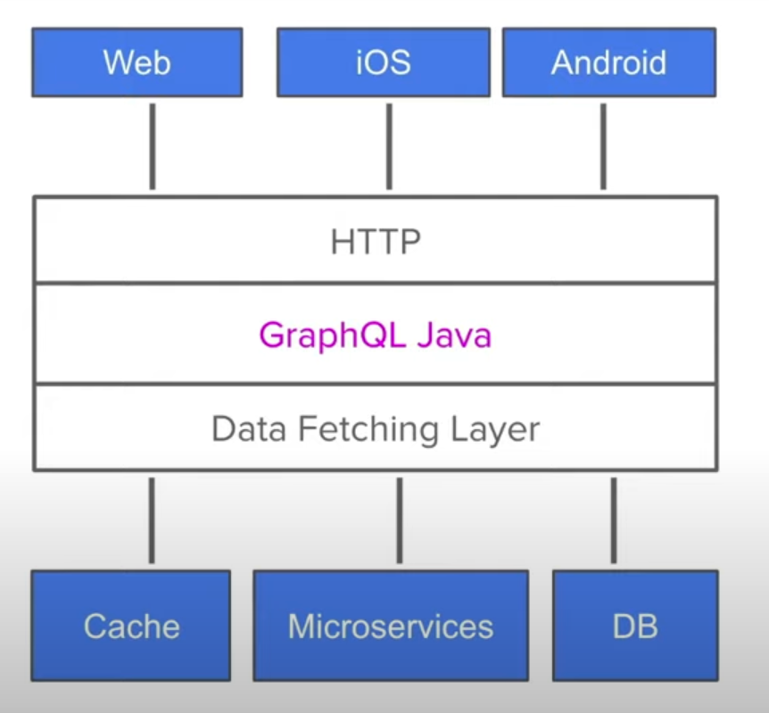
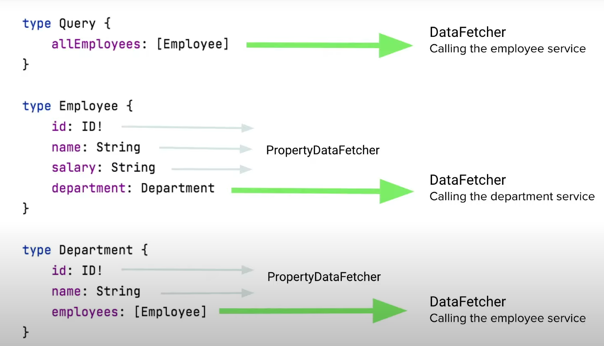
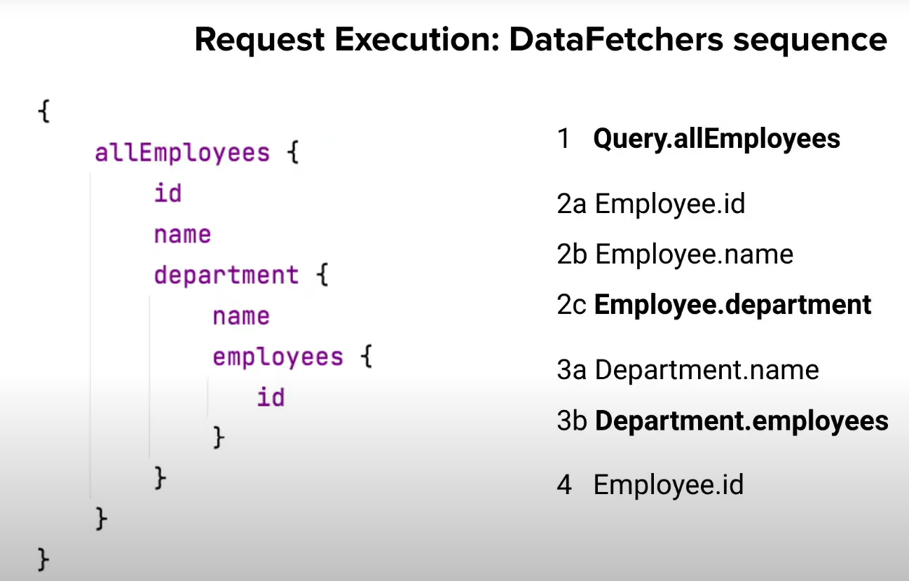
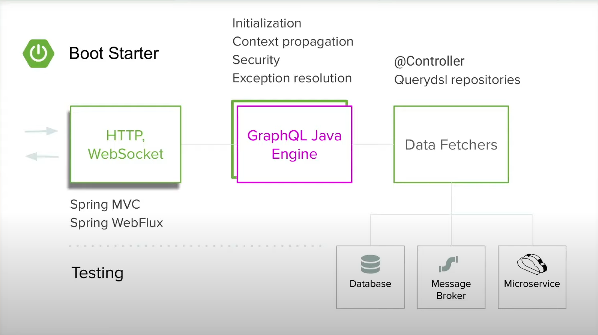
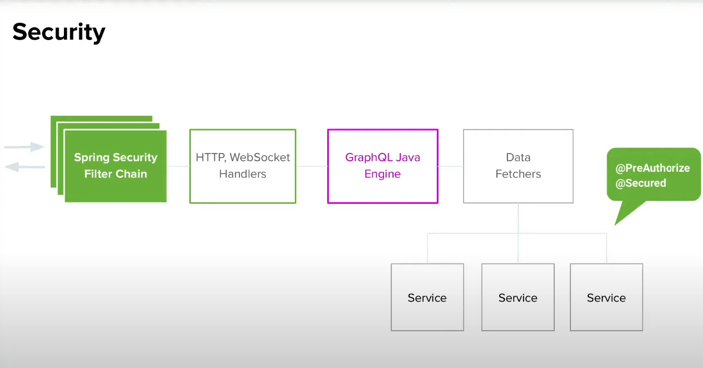

# GrapQL Notes  

### **What is GraphQL** 

* GraphQL is a technology for client server data exchange 
    * Client wants to access data on server across a network 
* Its has two building blocks 
    * Statically typed API or GraphQL Scheme 
    * Query Language 
* An alternative for Rest(ish*) API 
* Best fit for Single Page Apps and native clients 
* Its prevents overfecthing and underfecthing of data 
* Its sits on API layer behind HTTP before Data fetching layer 



### GraphQL Scheme 
* Describe API 
* Defined on the Server 
* Based on simple static types system 
* SDL(Scheme Definition Language) is used to describe a Schema 

### GraphQL Query Language 
* Custom Query Language 
* Clients define the Query based on thier needs 
* Every field needs to requested explicitly 


### GraphQL type system
* Object types
* Interfaces
* Unions
* Enumerations
* Fields
* Lists
* Scalars
    * String
    * Float
    * Int
    * Boolean 
    * ID 
    * Custom Scalars e.g Date 

### GraphQL Operartions 
* Queries 
    * To read data 
       ```yaml
        query {
            search (q : "name"){
                title 
                author
            }
        }
* Mutations 
    * To write data 
       ```yaml
        mutation {
            create (title: "book"){
               id 
            }
        }
* Subscriptions 
    * Listen for data
       ```yaml
        subscription {
            onCreate {
               id 
               title 
            }
        }    

### Think in GrapQL Java 
* Start designing by putting the Scheme first 
* Define the schema in SDL 
* Schema is made out of types with fields 
* Fundamental Rule is every field has "DataFetcher" associated with 
    * DataFetecher fetches data for one field 
    * When no DataFetcher is provided ,it uses default DataFetcher (PropertyDataFetcher)
    * When the Pojo matches with Scheme, PropertyDataFetcher is enough no need to provide custom DataFetcher

### DataFetcher  


### DataFetcher Sequence 
 * Note :2a,2b,2c are parallel calls <Br>



### SpringGraphQL Layout 


### Spring Security and Context Propagation  
* Spring MVC
    * ThreadLocal context Propagation from Servlet container thread 
    * Need to register ThreadLocalAccessor 
    * Built-in accessor for Spring Security Context propagated 

* Spring WebFlux 
    * Reactor Context propagation from weblayer 
    * Spring security context is propagated 

 